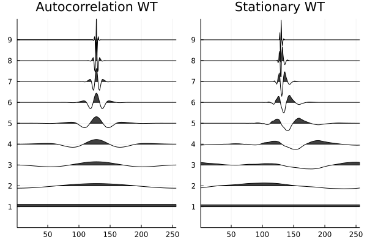
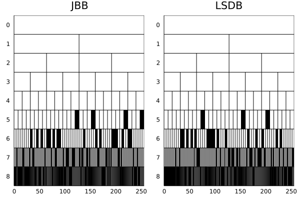
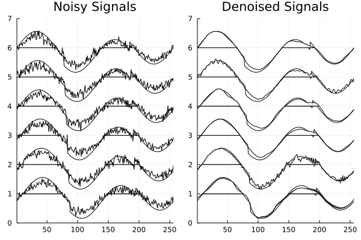

# Summary
Whether it is seismic surveys, ECG signals, stock market trends, or sensor data, the wavelet and wavelet packet transforms are powerful tools for signal analysis and classification with many advantages over the conventional Fourier methods. Primary among them is the ability to extract information localized in both time and frequency domains, enabling multiresolution analysis [@Daubechies:1992; @Mallat:2009]. As such, wavelets and wavelet packets have become popular tools for computational harmonic analysis. `WaveletsExt.jl` was developed to enrich the wavelet toolbox for Julia by providing routines for wavelet analysis, wavelet packet analysis, and associated utilities.

# Statement of Need
The principle package for wavelets in Julia is `Wavelets.jl` [JuliaDSP:2021], which provides the essential building blocks for data analysis using wavelets. These include 1-D, 2-D, and 3-D wavelet transforms via filter banks or lifting, a range of thresholding functions, and other utilities. However, as a general-purpose package for wavelets, `Wavelets.jl` does not include many targeted and sophisticated methods present in the literature.

`WaveletsExt.jl` (Wavelets Extension) is written to enlarge the wavelet toolbox for Julia by providing a host of wavelet routines such as stationary wavelet transform [@Nason:1995], autocorrelation wavelet transform [@Saito:1993], local discriminant basis [@Saito:1995], and shift-invariant wavelet packet decomposition [@Cohen:1995]. The package also contains denoising utilities such as SureShrink [@Donoho:1995] and Relative Error Shrink [@Irion:2017] as well as several features for data visualization.

One of the most distinguishing features of `WaveletsExt.jl` is the presence of algorithms for handling an ensemble of input signals. Currently, `Wavelets.jl` implements best basis selection utilities for wavelet packets for single inputs. However, it does not include methods for selecting a single best basis for a set of inputs with similar properties (e.g signals or images belonging to the same class), which is valuable for feature extraction and data compression. To address this, `WaveletsExt.jl` implements joint best basis [@Wickerhauser:1996] and Least Statistically Dependent Basis (LSDB) [Saito:1998] which are approximations of Prinicple Component Analysis (PCA) and Independent Component Analysis (ICA) respectively obtained using a dictionary of orthonormal bases.

# Examples
## 1. Redundant Wavelet Transforms
`WaveletsExt.jl` implements several redundant wavelet transforms including Stationary Wavelet Transform (SWT) and Autocorrelation Wavelet Transform (a special case of SWT). After performing the transform, users can visualize the result of the decomposition using the `wiggle` function.

```julia
using Plots, Wavelets, WaveletsExt

x = zeros(1<<8) # Generate a unit impulse (dirac delta) signal
x[128] = 1
wt = wavelet(WT.db4)  # Construct Daubechies 4-tap wavelet filter

# ----- Autocorrelation Wavelet Transforms -----
y = acwt(x, wt)
p1 = wiggle(y, sc=0.7) |> p -> plot!(p, title="Autocorrelation WT")

# ----- Stationary Wavelet Transforms -----
y = sdwt(x, wt)
p2 = wiggle(y, sc=0.7) |> p -> plot!(p, title="Stationary WT")

# Combine and save plot
p = plot(p1, p2, layout=(1,2), size=(600,300))
savefig(p, "transforms.png")
```


## Best Basis Algorithms
`WaveletsExt.jl` can select a single best basis for set of signals has via Joint Best Basis (JBB) and Least Statistically Dependent Basis (LSDB). Users may also visualize the resulting best basis tree using `plot_tfbdry`.

```julia
using Plots, Wavelets, WaveletsExt

# Generate 100 noisy heavysine signals of length 2⁸
x = generatesignals(:heavysine, 8) |> 
  x -> duplicatesignals(x, 100, 2, true, 0.5)

# Wavelet packet decomposition of all signals
xw = [wpd(xᵢ, wt) for xᵢ in eachcol(x)] |> 
  xw -> cat(xw..., dims=3)

# ----- Joint Best Basis (JBB)
tree = bestbasistree(xw, JBB())
p1 = plot_tfbdry(tree) |> p -> plot!(p, title="JBB")

# ----- Least Statistically Dependent Basis (LSDB)
tree = bestbasistree(xw, LSDB())
p2 = plot_tfbdry(tree) |> p -> plot!(p, title="LSDB")

# Combine and save plot
p = plot(p1, p2, layout=(1,2), size=(600,300))
savefig(p, "bestbasis.png")
```


## Denoising Algorithms
`WaveletsExt.jl` contains two functions for denoising: `denoise` and `denoiseall`. The former denoises a single signal whereas the is used to denoise a set of signals simultaneously.

```julia
using Plots, Wavelets, WaveletsExt

# Generate 6 circularly shifted heavysine signals
x₀ = generatesignals(:heavysine, 8) |> 
  x -> duplicatesignals(x, 6, 2, false)
# Generate 6 noisy versions of the original signals
x = generatesignals(:heavysine, 8) |> 
  x -> duplicatesignals(x, 6, 2, true, 0.8)

# Decompose each noisy signal
xw = [wpd(xᵢ, wt) for xᵢ in eachcol(x)] |> 
  xw -> cat(xw..., dims=3)

# Get best basis tree from the decomposition of signals
bt = bestbasistree(xw, JBB())
# Get best basis coefficients based on best basis tree
y = bestbasiscoef(xw, bt)

# Denoise all signals based on computed best basis tree
x̂ = denoiseall(y, :wpt, wt, tree=bt)

# Plot results
p1 = plot(title="Noisy Signals")
wiggle!(x₀, sc=0.7, FaceColor=:white, ZDir=:reverse)
wiggle!(x, sc=0.7, FaceColor=:white, ZDir=:reverse)

p2 = plot(title="Denoised Signals")
wiggle!(x₀, sc=0.7, FaceColor=:white, ZDir=:reverse)
wiggle!(x̂, sc=0.7, FaceColor=:white, ZDir=:reverse)

# Combine and save plot
p = plot(p1, p2, layout=(1,2), size=(600,300))
savefig(p, "denoising.png")
```


## Feature Extraction
Users can extract distinguishing features of signals locallized in time and frequency using Local Discriminant Basis (LDB). The algorithms extracts subspaces that discriminates different classes of signals.

```julia
using Plots, Wavelets, WaveletsExt

# Generate 100 signals for each class of cylinder-bell-funnel
X, y = generateclassdata(ClassData(:cbf, 100, 100, 100))
# View sample signals and how each class differs from one another
cylinder = wiggle(X[:,1:5], sc=0.3, EdgeColor=:white, FaceColor=:white)
plot!(cylinder, ylabel="Cylinder")
bell = wiggle(X[:,101:105], sc=0.3, EdgeColor=:white, FaceColor=:white)
plot!(bell, ylabel="Bell")
funnel = wiggle(X[:,201:205], sc=0.3, EdgeColor=:white, FaceColor=:white)
plot!(funnel, ylabel="Funnel")
p1 = plot(cylinder, bell, funnel, layout=(3,1))

# Instantiate the LDB object
wt = wavelet(WT.coif4)
ldb = LocalDiscriminantBasis(
  wt=wt,
  max_dec_level=7,
  dm=SymmetricRelativeEntropy(),
  en=TimeFrequency(),
  dp=BasisDiscriminantMeasure(),
  top_k=10,
  n_features=10 # Number of features to extract
)
                            
# Extract features using LDB
X̂ = fit_transform(ldb, X, y)

# Plot the best basis for feature extraction
p2 = plot_tfbdry(ldb.tree)

# Combine and save plot
p = plot(p1, p2, size=(600,300))
savefig(p, "ldb.png")
```


# Reproducible Research

`WaveletsExt.jl` was partially inspired by the WaveLab library in MATLAB which was developed with the goal of enabling reproducible wavelets research [@Donoho:1995]. In this spirit, we wrote a series of tutorials, examples, and experiments using `Pluto.jl`, a platform with which Julia users can build and share reactive documents [@Fonsp:2021]. By downloading and running Pluto notebooks, researchers and students alike can not only reproduce the results of our research but also interactively adjust parameters and see the changes in experiment outcomes.

- Denoising Experiments using Wavelet Transforms, Autocorrelation Wavelet Transforms, Stationary Wavelet Transforms [@Liew:2021]

- Feature Extraction for Signal Classification using Local Discriminant Bases [@Dan:2021]

# Acknowledgements
`WaveletsExt.jl` was partially developed under the Research Training Group (RTG) at the University of California, Davis which was funded by 
National Science Foundation grant no.

# References